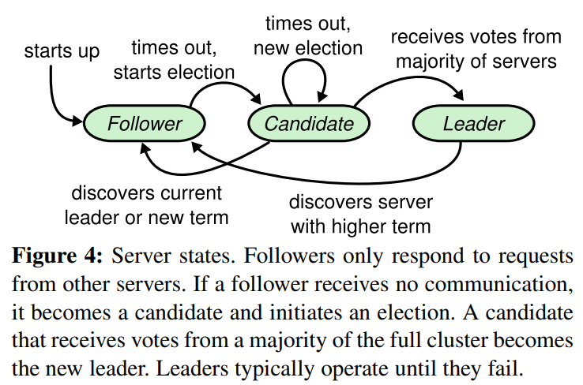

# 算法的基本概念

## 基本属性

## 节点状态

+ Follower Statement：接受各种rpc请求信息，心跳、日志同步等。
+ Candidate Statement：待选举状态
+ Leader Statement：leader状态，接受client的请求，向其他节点同步日志和发送心跳。

# 算法的基本流程：

## Leader选举：

初始化的时候，所有节点为

## 参考

+ https://raft.github.io/raft.pdf
+ https://raft.github.io/