## 《A Spatiotemporal Deep Learning Approach for Unsupervised Anomaly Detection in Cloud Systems》 笔记

论文地址：https://ieeexplore.ieee.org/document/9228885/

论文数据集：https://github.com/QAZASDEDC/TopoMAD

### 背景

+ 解决的问题场景：大规模云系统的中的异常检测问题。

+ 引入GNN的角度：
  + 考虑单一的Metirc可以提供单个层面级别的信息，而考虑组件的多种Metric可以提供组件级别的信息。
  + **各组成部分的相互作用关系。**
  + **拓扑信息的输入和组件级的输入构成了系统级的信息，可以更全面地了解整个运行系统。**
+ 传统DNN方法的弊端：
  1. 在决定组件是否处于异常状态时，有时需要考虑其连接的组件（一般DNN做不到）。
  2. 随着云系统复杂性的增加，为每个组件训练和维护单个模型的难度将越来越大。（尤其在微服务场景中，指标的数量成指数级增长，及其难维护）。
  3. 粗略地将整个系统看作一个笨重的组件会失去对其内部拓扑结构的洞察，从而可能增加对其正常行为建模的难度。

### motivation

1. 增加拓扑信息的好处：

   + 图神经网络的特征提取器共享于来自不同组件的同类指标之间，有助于在统一的特征学习下捕获相同指标类型之间的相似模式。

   + 端到端的引入拓扑的影响。
   + 拓扑信息可以引导模型将注意力集中在现实中具有直接连接和交互的组件上，这有助于防止模型的过拟合（GAT）。

2. 引入了无监督选择检测阈值的方法：

   + 过去的方法，类似DAGMM等，需要大量的阈值调参。在这里本论文引入无监督的模型来生成阈值，从而减少模型的调参难度。

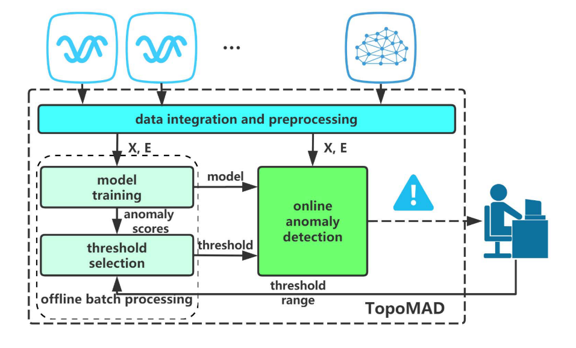

总体设计如上图

### 数据处理

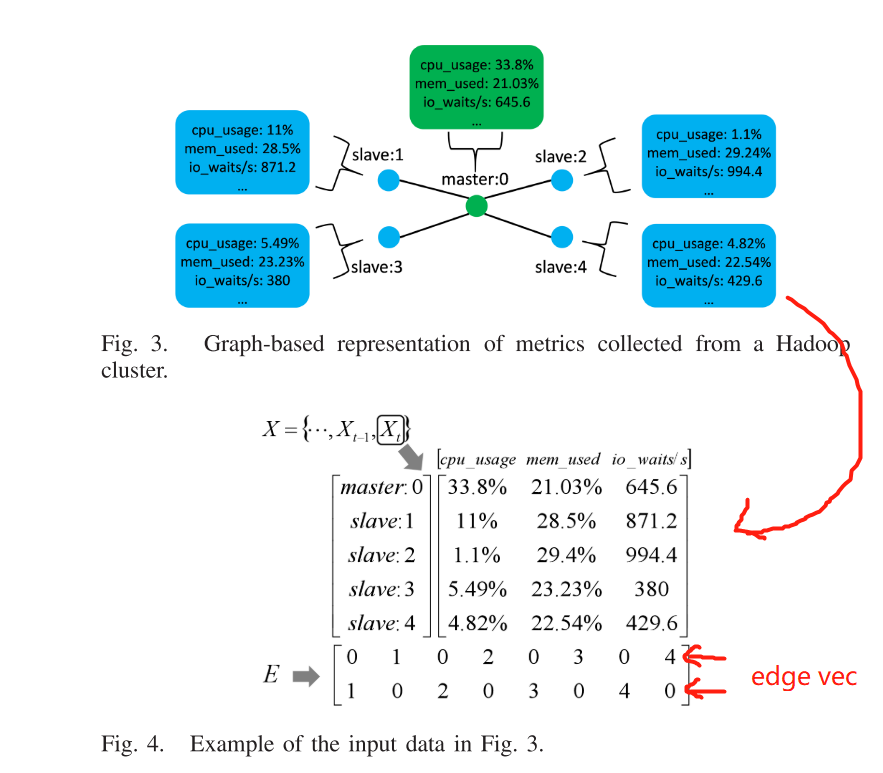

数据分为两类：

1. $X$ 为指标矩阵，横坐标是节点（Node），纵坐标是指标（Metric）。
2. $E$ 为连接矩阵，主要是`edge`的向量矩阵，每个`edge`为$E$的一个列向量。

### 模型设计

模型在VAE和seq2seq的基础上进行设计：

+ VAE因为其生成模型的特点，常作为异常检测的方法（生成模型能估计联合概率密度）。
+ Seq2Seq结构出自NLP领域，常用于序列建模，这也跟我们要处理的时间序列不谋而合。
+ 在这两个模型的基础上，引入Graph 网络对拓扑信息进行学习。

#### 1. GraphLSTM

GraphLSTM的主要思路是将LSTM中的全连接网络之前增加一个GNN，对拓扑信息和指标信息进行融合。

下面是两种LSTM的比较

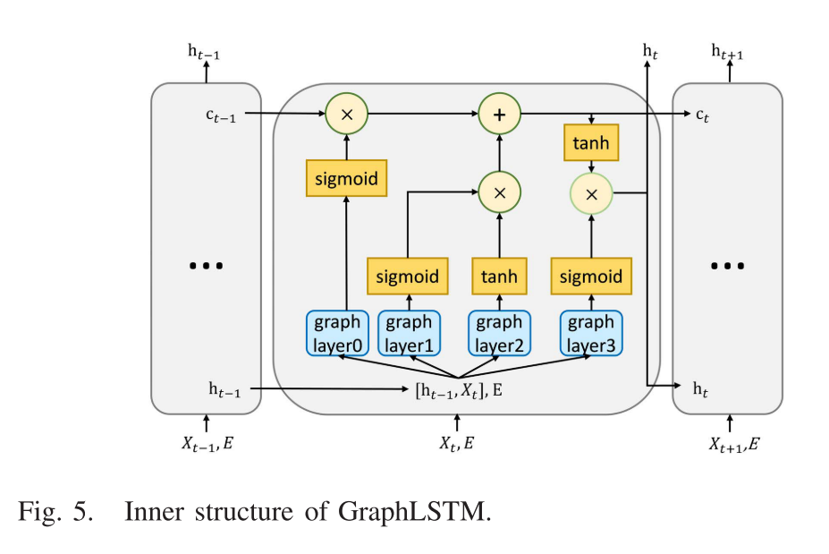

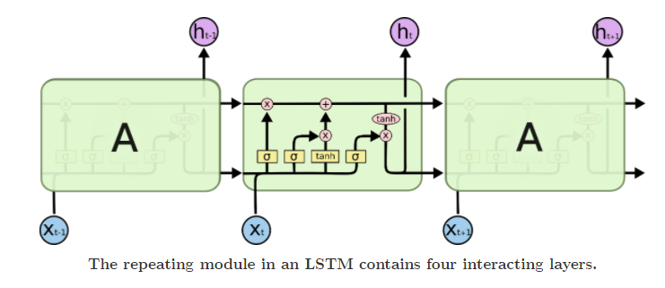

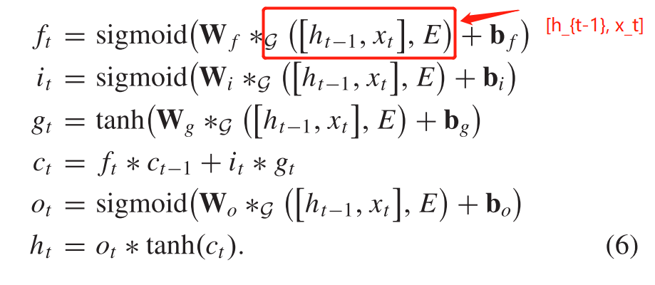

红框部分是由标准的LSTM中的$[h_{t-1}, x_t]$替换为$g([h_{t-1},x_t], E)$, 也就在之前添加了GNN作为拓扑信息和Metric信息的融合层，融合之后作为标准LSTM的输入。

#### 2. TopoMAD

之后论文提出了由`GraphLSTM`单元组成的`Seq2Seq+VAE` 的模型。在训练和推理阶段的结构如下图：

训练阶段：

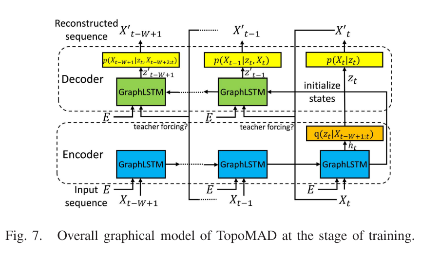

推理阶段：

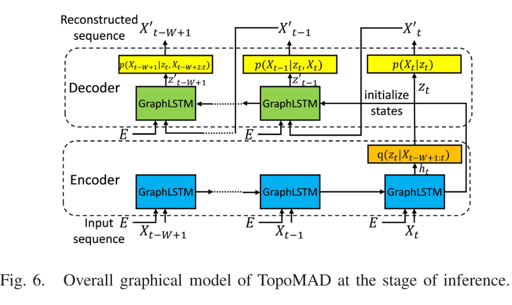

训练的时候`decoder`有$\lambda$的可能用原始输入$X$、$1-\lambda$使用重构后的值$X'$。（scheduled sampling process）

- 初始化的时候$\lambda$=1之后当val loss不减少的时候, $\lambda$减半。

**Loss** 采用VAE的ELBO Loss结构：

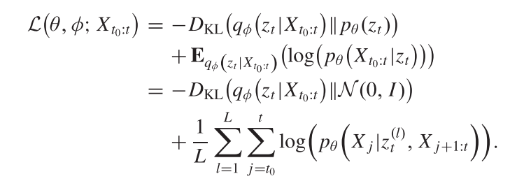

#### 3. 计算异常得分

$$
\operatorname{temp} S_{t}=-\mathbf{E}_{q_{\phi}\left(z_{t} \mid X_{t_{0}: t}\right)}\left(\log \left(p_{\theta}\left(X_{t} \mid z_{t}\right)\right)\right)
$$

$$
S_{t}=-\frac{1}{L * D} \sum_{d=0}^{D-1} \sum_{l=1}^{L} \log \left(p_{\theta}\left(X_{t} \mid z_{t+d}^{(l)}, X_{t+1: t+d}\right)\right)
$$
使用重构误差做为异常得分的计算：这种思想源于*《Variational Autoencoder based Anomaly Detection using Reconstruction Probability》*。其中$L$是采样数量，$D$是计算或更新一个异常分数的次数(the tolerance of detection delay)。

但是在某些情况下，**在某些情况下，系统中某个特定组件的相对较低的重构概率就足让我们将其判断为异常**。 因此，我们还从组件角度计算异常分数，如下所示：
$$
S_{t}=-\max _{0 \leq i<N} \frac{1}{L * D} \sum_{d=0}^{D-1} \sum_{l=1}^{L} \log \left(p_{\theta}\left(X_{t}^{i} \mid z_{t+d}^{(l)}, X_{t+1: t+d}\right)\right)
$$

也就是组件级别的异常。

#### 4. 阈值的选择：

本文提出的阈值选择一种阈值选择方法，假设正常数据的异常分数位于密度较高的区域，异常数据的异常分数位于密度较低的区域。
$$
d\left(S_{<\tau}, S_{>\tau}\right)=\frac{\min \left(S_{>\tau}\right)-\max \left(S_{<\tau}\right)}{\min \left(S_{>\tau}\right)+\max \left(S_{<\tau}\right)-2 * \min \left(S_{<\tau}\right)}
$$
基于这一假设，选择一个阈值，使该阈值从训练数据集中切割出的两个集合与一个算子提供的范围之间的距离最大化。

### 实验结果

#### 总体上跟其他方法的对比

本文实验使用了两个数据集，MBD（一个批处理的数据集）、NMS（微服务场景的数据集）。TopoMAD均好于传统方法。

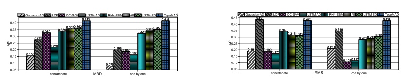

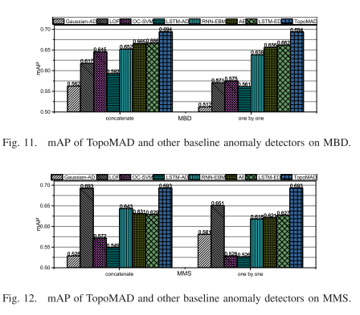

#### 鲁棒性

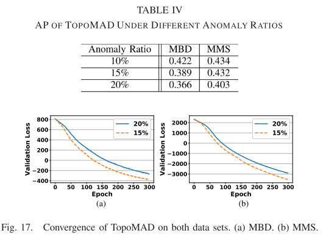

#### 可解释性

异常的隐变量和真实的隐变量差距不大，因此VAE不会重构异常。

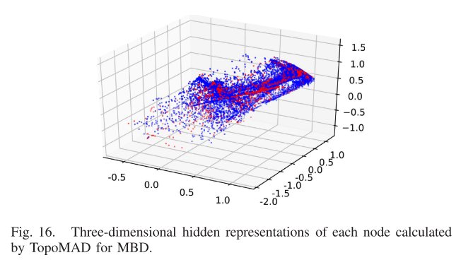

#### 消融实验

**空间信息的作用**：

实验方法是将$E$矩阵随机化，这样会混淆空间信息。结果表示在混淆空间信息之后，点数会有下降。

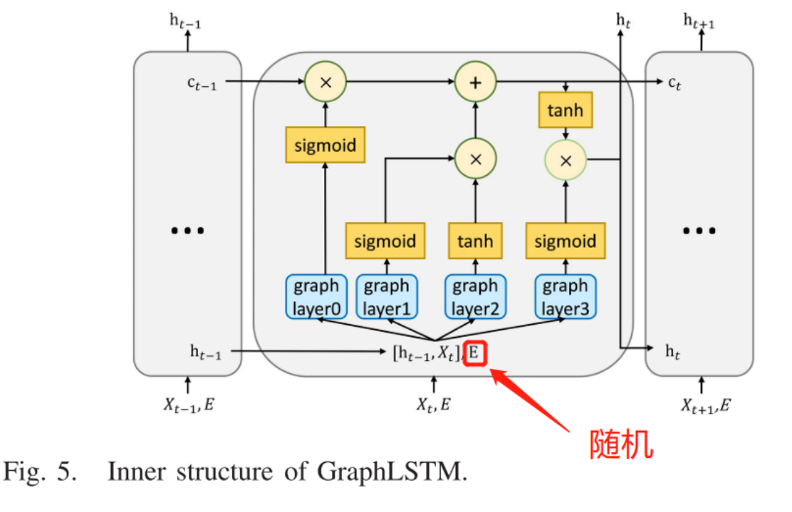

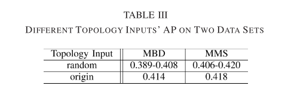

#### 复杂度分析

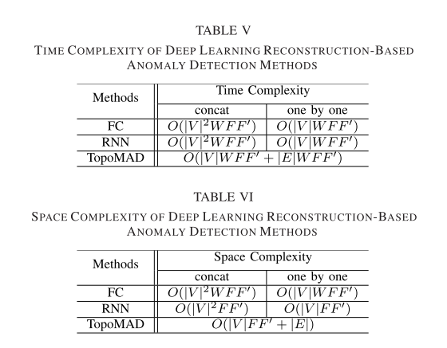

## 总结

本论文主要的目标是将拓扑信息融入到系统检测的过程中

+ 在传统的LSTM中使用GNN的方法引入了拓扑的信息。
+ VAE+Seq2Seq的形式，增加模型的学习能力。

本文还有另外的一个特点就是论文的写作风格特别好（在实验部分使用QA的方式来阐述实验的各个部分），实验做的非常非常全。

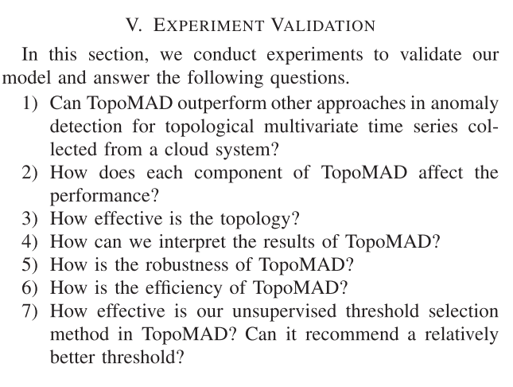

## 参考

https://colah.github.io/posts/2015-08-Understanding-LSTMs/