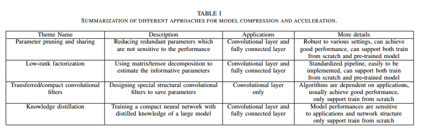
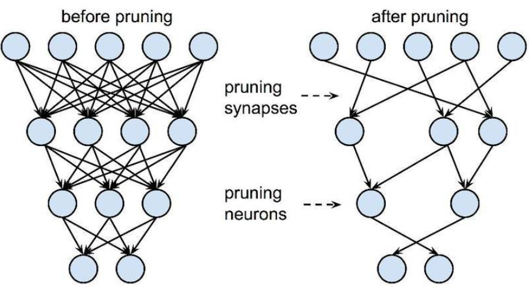
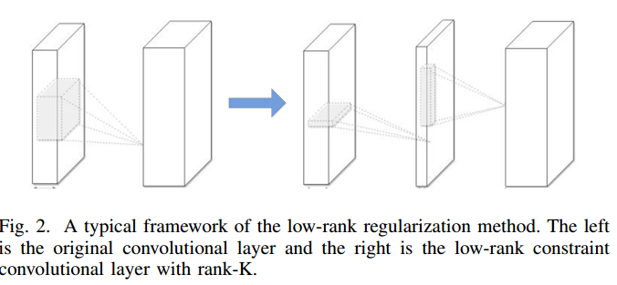
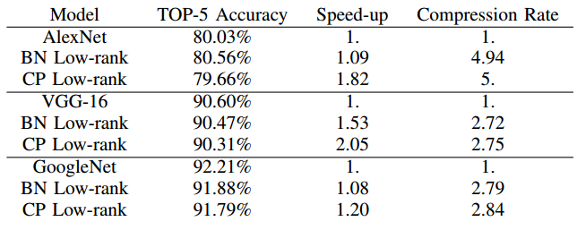
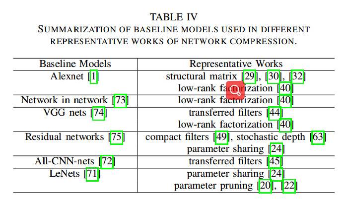

## Introduce

随着DNN的层数和节点个数越来越多，它面临着两方面的问题。一方面它的计算和存储成本越来越高，对一些及时性的程序带来了挑战（在线学习和增量学习）；另一方面由于小型化设备越来越普及，小型设备对DNN越来越强。但由于体积和计算难度，DNN在小型设备上的部署也面临挑战。

本文综述了最近几年ML、最优化、计算机体系结构、数据压缩、硬件设计等等方面对DNN加速和压缩方面的进展。

本文讲这些进展分为四个部分：
1. 参数裁剪和共享（parameter pruning and sharing）。其方法主要是去除模型中的冗余和非临界参数。
2. 低秩因子分解（low-rank factorization）。基于矩阵或者张量的分解，去估计DNN中参数的信息。
3. 转移/紧凑卷积过滤器（transferred/compact convolutional filter）。它主要是设计特殊的卷积过滤结构去减少参数的空间，减少模型大小和计算量。
4. 知识蒸馏（knowledge distilation）。知识蒸馏方法学习一个蒸馏模型，训练一个更紧凑的神经网络来重现一个更大的网络的输出。

这些方法都是独立的，我们可以将其混合使用而达到更高的压缩比和更快的速度。

## 参数裁剪与共享
之前工作表明网络的裁剪是减少网络复杂度和解决过拟合问题的一种有效途径。之后的研究又发现它也是一种压缩网络的一种很有效的方式。这种方法有四个分支：量化（quantization）、二值化（binarization）、参数共享（parameter sharing）和结构化矩阵（structural matrix）。

### 量化与二值化

网络量化通过减少表示每个权值所需的比特数来压缩原始网络。Gong et al.和 Wu et al. 使用k-means对参数进行量化。 Vanhoucke et al 研究表明8-bit的量化参数可以在很小准确率损失的情况下显著的提升速度。Han Song提出一整套压缩模型的过程。首先将一个训练好的模型不断的剪枝然后重新训练。将剪过枝的矩阵进行稀疏化。最终得到一个稀疏的参数。再对其进行量化和权值共享进一步的去压缩参数，最终得到了很高的压缩比和很少准确率损失的模型。

Y. Choi et al.研究表明Hessian权值可以用来度量网络参数的重要性，并提出将聚类网络参数的平均Hessian weighted量化误差最小化。

另外当权值被表示成1bit时也就参数了二值量化网络。有许多工作直接将CNNs训练为二值量化网络，例如BinaryConnect， BinaryNet、XNORNet。他们的主要思想是在训练是直接学习二值化的权值和激活值(activation)。在研究中表明经过反向传播训练的网络对包括二进制权值在内的特定权值失真具有较强的恢复能力。

#### 缺点
在量化级较多的情况下准确率能够较好保持，但对于二值量化网络的准确率在处理大型CNN网络，如GoogleNet时会大大降低。二值化网络的另一个缺点是现有的二值化方案基于简单的矩阵逼近，忽略了二值化对精度损失的影响

为了解决这些问题，近期的工作又提出了一个使用对角Hessian 估计的近端牛顿法(proximal Newton algorithm)在二值化网络中最小损失。 -----注意----

### 剪枝与共享

剪枝与权值共享都可以减少网络的复杂度和解决过拟合问题。早期剪枝的方法是偏差权重衰减（Biased Weight Decay），其中最优脑损伤（Optimal Brain Damage）和最优脑手术（Optimal Brain Surgeon）方法，是基于损失函数的Hessian矩阵来减少连接的数量，实验表明这种剪枝的方法比通过权值绝对值阈值的剪值更有效。

最近的工作倾向是去裁剪预训练模型（pre-trained CNN model）冗余或者没有信息的权值。
主要进展为 Srinivas等人研究冗余情况，提出一个不需要数据的去除冗余神经元的方法（a data-free pruning method to remove redundant neurons）。Han等人提出了提出减少整个网络中参数和操作的总数的方法。Chen等人提出HashedNet实现了权值共享。Han Song提出了量化和权值共享综合的方法。 K. Ullrich等人提出了训练边剪枝和压缩的方法。

另一个发展方向就是训练具有稀疏约束（sparsity constraints）的紧凑的CNN。他们经常将l0或者l1范数调节器引入问题中。从而达到稀疏和剪枝的效果
这些稀疏约束通常作为l_0或l_1范数调节器在优化问题中引入。

V. Lebedev等人利用对卷积过滤器的稀疏约束来实现脑损伤。比如按组去修剪卷积核。

#### 缺点

用l1或l2正则化进行剪枝需要比一般方法更多的迭代来收敛。此外，所有剪枝标准都需要手动设置层的灵敏度，这需要对参数进行微调，对于某些应用程序可能很麻烦。

### 设计结构化的矩阵
参数是矩阵是一个M*N的矩阵但是其描述参数比M*N少的多。他的优点是减少内存消耗，而且还可以通过快速的矩阵-向量乘法与梯度计算显著的加快推理和训练的速度。
当然它也有很多问题，比如说依赖先验知识，结构约束必定会导致精确度的损失，因此约束可能会给模型带来偏差。同样找到一个合适的结构矩阵非常困难，而且没有理论方法进行推导。因此无法广泛使用。

## 低秩分解和稀疏性

卷积操作在CNN计算中占据了大量的计算量，因此减少卷积层将会提高压缩率和速度。对于卷积核，我们可以将它视为一个4D张量。因此对其进行分解会降低其中的冗余。FC层可以视为一个2D的矩阵，对其进行低秩分解可以减少冗余。

低秩估计是一层一层进行的。在一层完成之后一层的参数就被固定，后会通过重构误差准则再进行微调。如图

沿着这个方向，又衍生了很大方法，比如说 CP 分解（Canonical Polyadic decomposition）和使用BN（Batch Normalization）去变换激活值。通常CP分解与BN都可以运用在从头训练CNNs。但是两者又有些不同。

### 缺点
低秩方法是一种简单直接的模型压缩与加速的方法。这个想法在在深度学习方面最近有所补充，比如说Dropout、Rectified units 和 maxout。由于分解这个操作很难实现，而且分解操作的计算代价很大。另一个问题是，目前的方法是逐层执行低秩近似，因此不能执行全局参数压缩，这一点很重要，因为不同的层包含不同的信息。另外它还需要大量的模型重新训练来保证他的收敛性。

##  转移/紧凑卷积过滤器

-----------

待续

-----------

## 知识蒸馏（knowledge distillation）
Caruana等提出了知识迁移（knowledge transfer）去压缩模型。但是这种方法只存在与浅层学习中。其主要是训练一个对伪数据标签有强分类的一个压缩/集成模型。
该思想最近知识蒸馏（knowledge distillation）中被采用，并且可以使得深度模型转化为浅层模型。其主要思想是。通过softmax学习类的分布把大模型转化为小模型。

G. E. Hinton等人提出了KD压缩模型的框架，它通过student-teacher（学生会根据老师的软化<softed>的输出而被惩罚） 范式去进行DNN的训练。
A. Romero等人的工作通过使用一个瘦而深的网络去压缩一个宽而浅的网络。为了从teacher network中学到中间表示（intermediate representations），FitNet需要student network去模仿teacher network的所以特征，但是这个很难做到。
还有一些知识蒸馏的扩展方向：
A. Korattikara Balan等人的工作训练了一个参数化的学生模型来近似蒙特卡罗老师。该框架采用在线训练，学生模型采用深度神经网络。T. Chen等人使用较高隐层的神经元来表示知识，而不是使用软化标签概率（soften label probabilities）表示知识，它保留了与标签概率（ label probabilities）相同的信息，但更紧凑。T. Chen等人的工作使用及时训练的方式传递知识，加速网络的训练。S. Zagoruyko等人提出了 Attention Transfer（AT）的方法宽松了FitNet的假设。

### 缺点
KD-base 可以使得深度模型更轻量化，可以显著的减少计算花销。但是它只能用于softmax loss function做多分类的模型。还有就是它的模型假设太过于严格。

## 基准、评估、数据库

作为基准的模型：

### 经典的评估方法
假设a是模型M的原始参数个数，a\*是已经压缩过模型的参数个数。那么压缩率为

$$\alpha(M, M^*) = \frac{a}{a^*}$$

也可以使用index space saving去度量

$$\beta(M, M^*) = \frac{a - a^*}{a^*}$$

相同的加速比我们可以使用

$$\delta(M, M^*) = \frac{s}{s^*}$$

**不同的CNN使用的压缩和加速方式不同，对于CNN来说，大部分参数集中在全连接层，而大部分运算量集中在前面的卷积层中**

## 讨论与挑战

### 一些建议

没有绝对的对压缩与加速的方法，只能根据场景与需求选择相对较好的方法。
+ 如果是想要压缩预训练模型（pre-trained deep nets）的话可以使用剪枝、权值共享或者低秩分解。如果需要端到端（end-end）的解决方案的话使用低秩分解和转移卷积滤波器的方法
+ 对于某些特定领域的应用，具有人类先验知识的支撑。使用一些转移卷积滤波器（transferred convolutional filter）和结构化矩阵（structural matrix）这些具有先验知识的方法效果会更好。
+ 剪枝与共享的方法在不影响压缩精度的前提下，通常能给出合理的压缩率。因此，对于需要稳定模型性能的应用程序，最好使用剪枝和共享。
+ 如果在时间场景中只包含 小型/中型的数据集可以尝试一下知识蒸馏的方法。这个方法在数据集不大的情况下有很高的鲁棒性。
+ 上面的方法都是独立的，因此我们可以他们两三个组合。例如目标检测的这项领域，使用的模型往往都含有卷积层和全连接层。我们可以使用低秩分解等方法压缩CNN，可以使用剪枝等方法优化全连接层。

### 挑战

+ 大多数最新最好模型基本都是精心设计的，结构和参数能改动的空间很少。
+ 各种小的硬件平台的约束，如何去充分利用有限的计算资源，如何为这些平台提供更好的压缩方式是一个很大挑战。
+ 通道剪枝虽然可以有效的减少模型的尺寸，但是会极大的改变下一次的输入。
+ 虽然各种压缩方法取得了巨大的成就，但是DNN的黑盒机制还是阻碍他应用的一个很关键问题。

### 可能的解决办法

为了解决超参数调参的问题，我们可以以来最近的learning-to-learn 策略。该框架运行算法可以自动优化结构和超参数，最近，利用强化学习来有效地采样设计空间和改进模型压缩也进行了尝试。

硬件感知（hardware-aware）也是加速CNN的一种途径。

通道剪枝（Clannel pruning）由于其对实现没有特殊需求，因此对GPU和CPU都有利。其有两种方法。一方面 使用基于训练的通道剪枝方法，其侧重对权重的稀疏化。但是这种方法需要从头开始训练因此花销很大。另一方面Liu等人研究表明，修剪后的体系结构更为关键。
