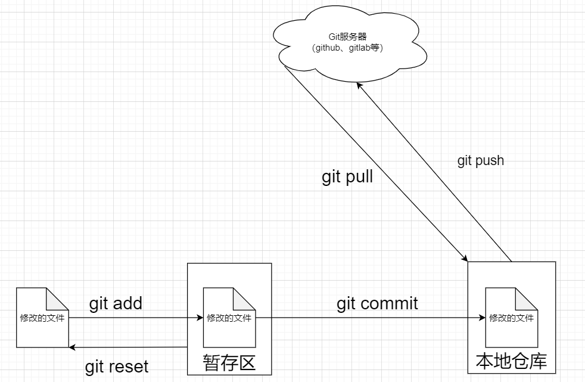
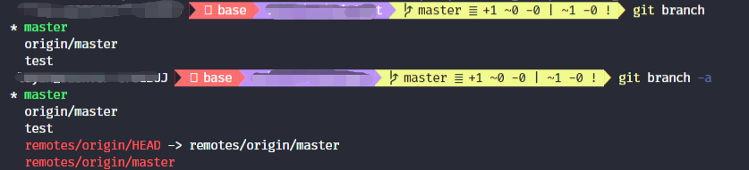
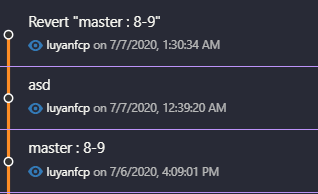
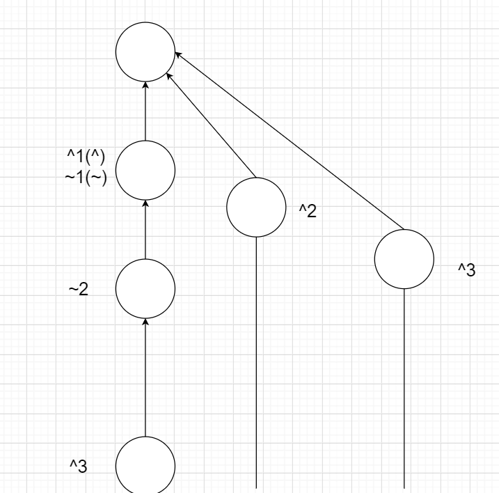
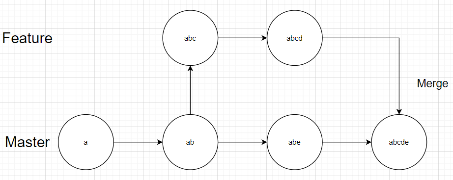
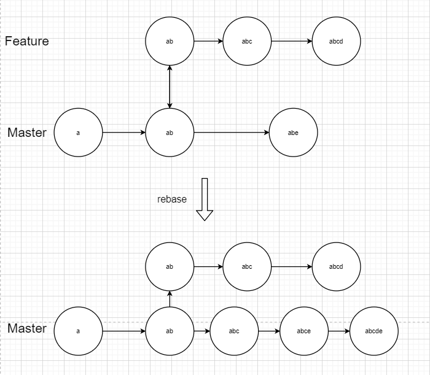
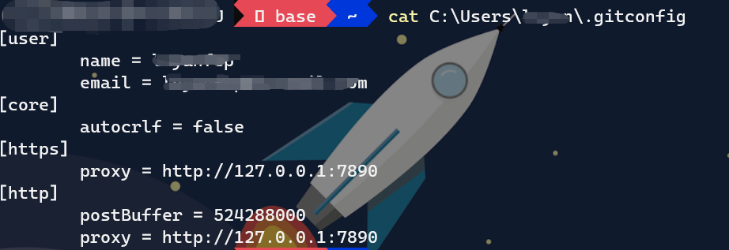
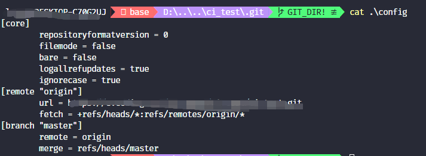

# Git

## 基础操作

1. 初始化仓库`git init`
2. `git add [file]`， 将文件的修改部分增加如暂存区，修改了什么可以使用`git diff --cached`进行查看
3. `git reset [file]`， 从暂存区
4. `git commit -m "commit信息"` 将修改好的代码`commit`到仓库。
5. `git push origin` 推送到`origin`
6. `git pull origin` 从远程服务器上拉取



## 分支操作

1. 查看分支`git branch`：查看分支所有`-a`

   

2. 创建分支`git branch [branch_name]`：从当前分支创建新的分支。

3. 修改分支名称`git branch -m [old_branch] [new_branch] `：重命名指定branch

4. 删除`git branch -d [branch_name]`：

5. 切换分支`git checkout [branch_name]`：

6. 合并分支`git merge [branch_name]`和`git rebase [branch_name]`： 将`branch_name`合并到当前分支。

### 对分支回退的控制

1. `reset`：只更改HEAD指针指向的commit id，如果这个操作撤回某些commit，则这些commit在log里会消失，**并且这些commit引用会在git的垃圾回收处理过程中被删除**，也就是这部分树枝之后会被锯掉。`git reset --hard (--soft, --fix) {[局部索引值]、[HEAD^](后退一部)、[HEAD~n](后退n步)}`
   + `--soft`是仅仅在本地库中移动`HEAD`指针。
   + `--mixed`是在本地库中移动指针，重置缓冲区。
   + `--hard`是本地库、暂存区、工作区全部重置。

2. `checkout`：则为移动的目标指针单独建立一个分支，并移动HEAD，原分支不变。

3. `revert`：新建一个commit，指针后移，并将目标commit的内容作为本次commit的内容，个人感觉这种操作更安全，毕竟会保留之前的记录。(但是要注意，如果你合并了某个分支，并且revert该分支中的一个commit，**不要以为再合并一次这个分支就可以还原那个revert，是不行的，git会默认把这个revert导致的差异对冲掉，你如果想还原，要么reset或者revert那次revert**， revert无法撤销分支的`merge`）。



#### 指针的控制

`^\~`前面为相对谁, 比如说相对master 或者相对

`^` 第n个父亲， 如果有分支

`~`第n个直系上级



### merge和rebase的区别

`merge`和`rebase`是两种合并分支的方式，其中`merge`是直接将两个分支有依赖的合并，`abcde`的节点需要依赖`Feature`分支。不同的是`rebase`合并，就是将`Feature`中做修改的部分直接合并进去`Master`作为一个单独的节点，不依赖`Feature`分支。不同的方式见图。







## 远程操作

1. 远程获取仓库：`git clone -o [remote主机名]` 可以增加`remote`主机名，默认为`origin`

2. 修改`remote`信息：`git remote`、`git remote show [主机名] `可以展示主机的详细信息。`git remote add/rm/rename [主机] [网址]` 可以添加、删除或者改名远程主机

3. 获取远程服务器的修改信息：`git fetch`：从某个远程服务器中取回分支`git fetch [远程服务器] [分支名称]`，如果分支名称没指定的话就默认取回所有的分支。取回的分支名字在本地为`[主机名]/分支名`，例如`origin/master`，可以使用`git branch -r`的方式查看远程分支。

4. 远程服务器与本地服务器合并`git pull`：`git pull [远程主机名] [远程分支名]:[本地分支名]`如果省略本地分支` [远程分支名]:[本地分支名]`的名称的话，就是合并到当前分支。如果省略远程主机名的话，回自动的合并当前分支绑定的远程分支。

   + `git pull origin master`  就等价于`git fetch origin && git merge origin/master`

   + 在某些场合，Git会自动在本地分支与远程分支之间，建立一种追踪关系（tracking）。比如，在`git clone`的时候，所有本地分支默认与远程主机的同名分支，建立追踪关系，也就是说，本地的`master`分支自动"追踪"`origin/master`分支。如果要手动设置tracing关系`git branch --set-upstream [本地] [远程主机]/[分支名称]` 

   + 同样也可以使用`rebase`合并分支，只需要`--rebase`

   + `git pull` 不会拉取远程被删除的分支，防止本地的某些分支在不知情的情况下被删除。如果做响应的操作的话`--prune/-p`

5. 向远程服务器推送信息`git push`：标准写法`git push [远程主机] [本地分支名]:[远程分支名]`。

   + 通`pull`如果不指定远程分支名称，则`push`到对应的trace分支，如果存在多个绑定的远程分支也可以使用`git push -u`指定一个默认的远程仓库，之后`git push`会自动的推送到该默认仓库。

   + 如果其不存在会新建一个远程的分支。

   + 如果**省略本地分支名**，则表示删除指定的远程分支，因为这等同于推送一个空的本地分支到远程分支。

     ```shell
     git push origin :xxx
     # 等价于
     git push origin --delete xxx
     ```

   + 如果需要推送所有分支`--all`
   + 如果本地比远程版本较老的话`push`会出错，此时使用`--force`可以强制推送，但是会覆盖远程
   + 默认不推送标签，需要`--tags`的指令。


## 配置

全局配置在`~/.gitconfig`中，可以在里面修改代理、`user`信息等



可以使用指令`git config --global`进行设置


本地配置在`[project_dir]/.git/config`z中，其中配置更多的在本地的信息，比如说`分支信息`，`remote`信息等等




## Git 理论

两个概念`Object Database`和`Current Directory cache`

> 暂时空下来，埋坑，之后补全

## 一些好用的小指令

1. `git log --graph`可以用图的方式展示git当前分支的的`commit`情况。
2. `git`设置代理：
   + `git config --global https.proxy [代理url]:[port]`
   + `git config --global http.proxy [代理url]:[port]`
   + 取消代理`git config --global --unset [https.proxy]/[http.proxy]`  

3. `git cherry-pick`： https://zhuanlan.zhihu.com/p/90816644

## 参考资料

+ https://www.ruanyifeng.com/blog/2014/06/git_remote.html

+ https://zhuanlan.zhihu.com/p/71577255

+ https://zhuanlan.zhihu.com/p/132406345