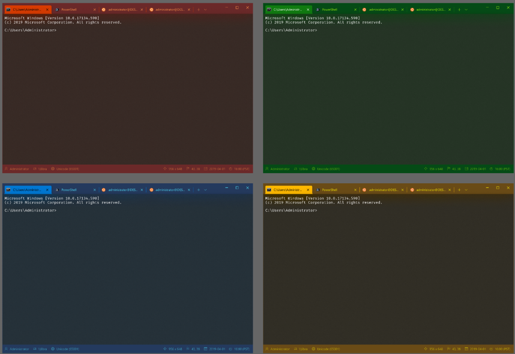
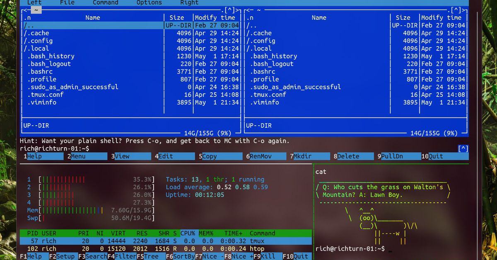
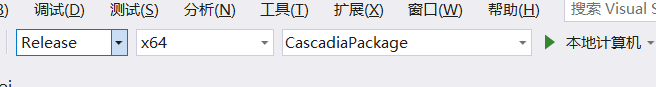
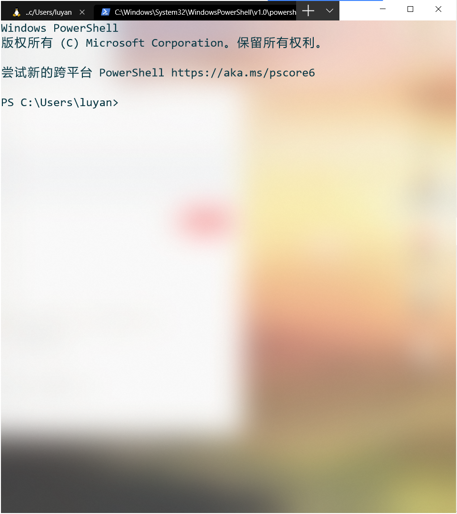
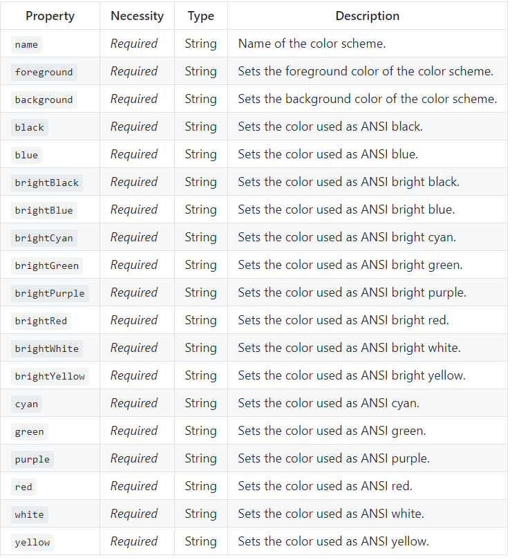

# WindowsTerminal尝鲜踩坑

## 基本介绍

WindowsTerminal是微软新发布的一款Terminal产品（以下称），对比之前传统的`CMD`和`Powershell`来说，`WT`对定制的支持更好，同时又支持GPU对页面的渲染、emoj表情、多标签等的特点。
其项目地址为：https://github.com/microsoft/terminal

官方演示图片如下：



## 如何获取

现在`WT`仍然处于开发阶段，但是官方还是放出了一个preview的版本可以通过`Window Store`下载（ 链接：https://www.microsoft.com/en-us/p/windows-terminal-preview/9n0dx20hk701 ），也可以通过将`github`上的项目clone之后编译。

**但是无论是编译还是在官方下载的，都需要将window升级到1903**

### 自己编译

编译条件：
+ 在window中 设置-更新-开发者选项中中选择开发者模式
+ VS2017 或者 VS2019
+ Win10 SDK 10.018362（最新版SDK即可）
+ .net桌面开发
+ C++桌面开发
+ 通用windows平台开发

在进入VS的时候如果缺少哪一个，解决方案上方会有提示，直接按照上面的提示安装即可。

编译过程
1. 首先将项目使用`git clone https://github.com/microsoft/terminal.git`克隆本地
2. 直接在该文件中双击`OpenConsole.sln`，在VS中打开
3. 将调整为，在本地计算机中运行即可
4. 如果想部署到电脑点击解决方案中的`Terminal/CascadiaPackage`右击生成、然后再右击部署即可。

## 如何定制一个属于自己的Terminal

新的`WT`最大的优点是相对与`Windows`之前的Terminal多了一些可定制性。设置主要分成四种
1. 快捷键的设置
2. shell
3. 页面
4. 配色

### profiles.json文件

Terminal的设置是一个json文件，名字为`profiles.json`中。此文件可以通过`WT`的下拉菜单的`setting`中。此文件位于`%USERDIR\AppData\Local\Packages\Microsoft.WindowsTerminal_8wekyb3d8bbwe\RoamingState`中（preview）或者`%USERDIR\AppData\Local\Packages\WindowsTerminalDev_8wekyb3d8bbwe\RoamingState\profiles.json`中（自己编译和部署的），其中`%USERDIR`为用户目录。

> 踩坑指南:
> 
> 如果profiles.json中有配置错误的地方Terminal就会无法打开，这个BUG现在修复中。因此如果无法打开Terminal的话，首先要检查profiles.json中是否有配置错误的地方，尤其小心字母打错。
>
> 还有就是如果preview版本的配置会同步到Windows账户，如果在其他的电脑上下载的WT的preview版本，但是无法打开时，就要检查profiles.json中的字体和图片是否是正确的或者是否存在这个字体和图片。
> 还有就是使用WinAPP的清除配置的方式清除配置无法清除profiles.json

#### 快捷键

此处采用key-value模式进行设置，在json中设置如下：
其中command有如下的种类：

```c#
enum class ShortcutAction : int32_t
    {
        CopyText = 0,
        PasteText = 1,
        NewTab = 2,
        NewTabProfile0 = 3,
        NewTabProfile1 = 4,
        NewTabProfile2 = 5,
        NewTabProfile3 = 6,
        NewTabProfile4 = 7,
        NewTabProfile5 = 8,
        NewTabProfile6 = 9,
        NewTabProfile7 = 10,
        NewTabProfile8 = 11,
        NewWindow = 12,
        CloseWindow = 13,
        CloseTab = 14,
        NextTab = 15,
        PrevTab = 16,
        SplitVertical = 17,
        SplitHorizontal = 18,
        SwitchToTab0 = 19,
        SwitchToTab1 = 20,
        SwitchToTab2 = 21,
        SwitchToTab3 = 22,
        SwitchToTab4 = 23,
        SwitchToTab5 = 24,
        SwitchToTab6 = 25,
        SwitchToTab7 = 26,
        SwitchToTab8 = 27,
        IncreaseFontSize = 28,
        DecreaseFontSize = 29,
        ScrollUp = 30,
        ScrollDown = 31,
        ScrollUpPage = 32,
        ScrollDownPage = 33,
        OpenSettings = 34,
    };
```

在`profiles.json`中的配置

```json
"keybindings" :
        [
            {
                "command" : "closeTab", // 这里是命令
                "keys" :  // 这是快捷键
                [
                    "ctrl+w"
                ]
            }
        ]
```

### 页面的配置

页面配置主要分为全局页面配置和每一个profile的页面配置

#### 全局页面配置

全局页面设置常用的主要为: 
+ 设置窗口大小，使用 `initialCols` 和 `initialRows`
+ 默认打开的Shell，通过使用`defaultProfile`，它的参数为一个string类型的guid，每一个profile都有自己的guid，格式为`"{00000000-0000-0000-0000-000000000000}"`
例如在我的配置中
```json
{
    "globals": {
        "defaultProfile" :"{61c54bbd-c2c6-5271-96e7-009a87ff44bf}",
    },
    "profiles": [
        {
            "commandline" : "powershell.exe",
            "guid" : "{61c54bbd-c2c6-5271-96e7-009a87ff44bf}"
        }
    ]
}
```
这样无论是直接打开`WT`还是按`+`按钮打开一个新的tab都默认是的`powershell`

#### 页面配置

```json
{
    "acrylicOpacity" : 0.5, // 透明度
    "closeOnExit" : true,
    "colorScheme" : "Campbell", //主题
    "commandline" : "wsl.exe -d Ubuntu-18.04", // 启动shell的命令
    "cursorColor" : "#FFFFFF", // 光标的颜色
    "cursorShape" : "bar", //光标的形状，变量有 "vintage" ( ▃ ), "bar" ( ┃ ), "underscore" ( ▁ ), "filledBox" ( █ ), "emptyBox" ( ▯ )
    "fontFace" : "Fira Code", // 字体设置
    "background" : "#000000", // 背景颜色， 它会覆盖掉主题中的background 
    "fontSize" : 15, // 字体大小
    "guid" : "{c6eaf9f4-32a7-5fdc-b5cf-066e8a4b1e40}", // guid 必须为"{00000000-0000-0000-0000-000000000000}"格式
    "historySize" : 9001, // 能显示的历史命令个数
    "icon" : "ms-appx:///ProfileIcons/{9acb9455-ca41-5af7-950f-6bca1bc9722f}.png", 
    "name" : "Ubuntu-18.04", // 名称，显示在菜单中
    "padding" : "0, 0, 0, 0",
    "snapOnInput" : true,
    "useAcrylic" : false, // 是否显示背后的纹理
    "backgroundImage" : "ms-appdata:///roaming/test.jpg", // 图片的一个路径,需要绝对路径
    "backgroundImageOpacity" : 0.75,  // 背景图的透明度
    "backgroundImageStrechMode" : "fill" // 填充方式

}
```

这里要特别注意三个设置

1. `background` 如果在`profile`中设置的话会覆盖`theme`中的`background`。
2. `acrylicOpacity`这个属性生效的前提是`useAcrylic`的值为`true`
3. `backgroundImage` 等属性生效的前提是`useAcrylic`的值为`false`

**`useAcrylic` 这个属性是决定能不能通过页面去显示页面后的内容**
例如：
当`"useAcrylic" : true`时，效果如下


此时可以通过`acrylicOpacity`去调节透明度。此时背景图片的设置就无法实现。如果要设置背景图片的话使用`"useAcrylic" : false`再进行设置

### 主题配置

主题的配置在`profiles.json`文件中的`schemes`属性中,官方为我们提供了`Campbell、One Half Dark、One Half Light、Solarized Dark、Solarized Light`五种默认的主题。我们可以在profiles中直接设置使用。

我们也可以自建主题，相关的配置参数如下：



同时官方又给我们提供`ColorTool`工具帮助我们更快的设置主题颜色，`ColorTool`可以直接使用`iterm2`的配色文件，因此能够让我们更多样的选择主题。

但博主无法使用改工具对`WT`的配色进行修改，找了`issue`和各种资料均为找到答案。可能是`ColorTool`尚未实现对`WT`的操作，只实现了对`CMD`、`PowerShell`、`WSL`的操作。
